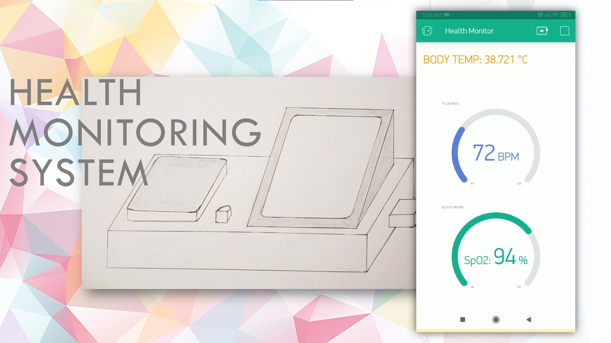
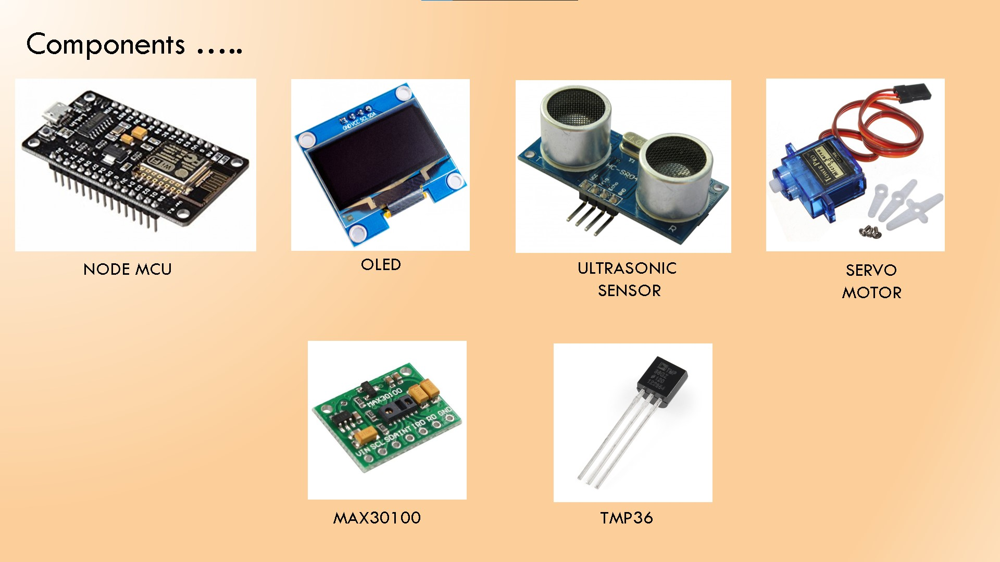
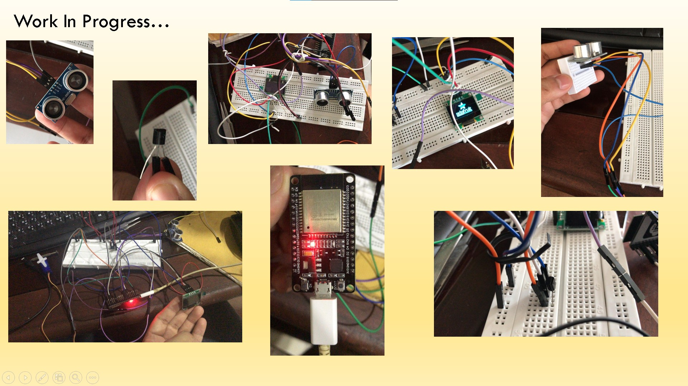
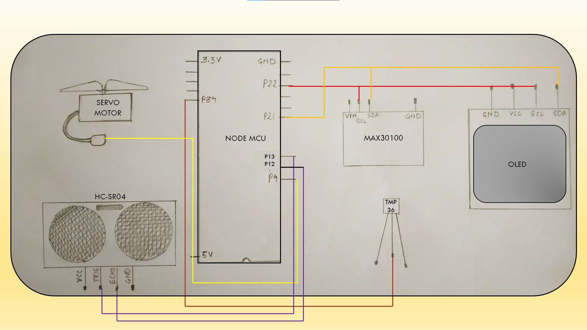
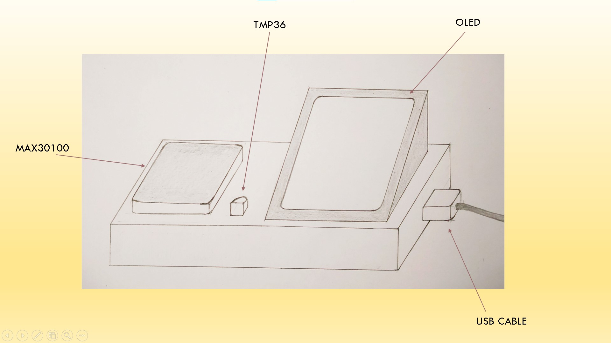
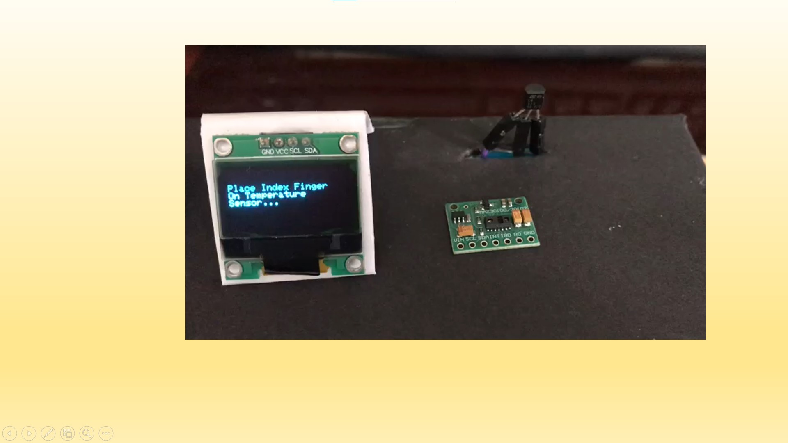
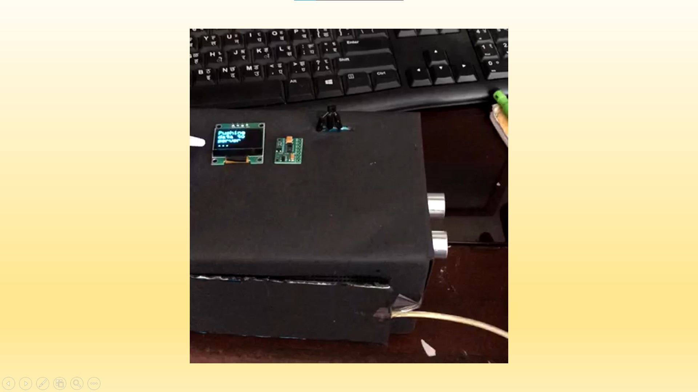
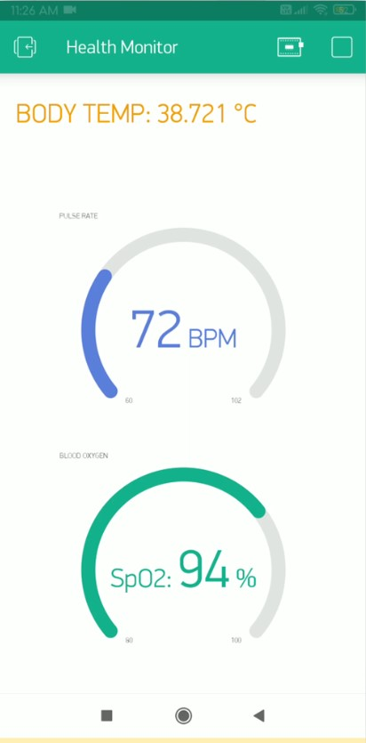

# An IoT based health monitoring device #

  

`A Node-MCU based device that monitors user's health parameters such as body temperature, blood pressure and blood oxygen % (SpO2) and shares them on the user's smart-phone in realtime.
Built in my Second year as part of academic mini-project.`

- [x] `An ultrasonic sensor detects an approaching person and signals the controller which turns the servo motor attached to the door and also wakes up the monitoring system.`
- [x] `The Max30100 and lm35 sensors measure the pulse-rate, blood oxygen level and body temperature of the person.`
- [x] `The data can be viewed on the person's smartphone when connected to the same Wi-Fi`

Circuit Connections:-

Design Sketch:-

Actual System:-

Smartphone Screen:-
 

`Source Code is written using Arduino IDE.`

*References*:
 https://randomnerdtutorials.com/esp32-ssd1306-oled-display-arduino-ide/
 https://randomnerdtutorials.com/esp32-servo-motor-web-server-arduino-ide/
 https://esp32io.com/tutorials/esp32-ultrasonic-sensor
 https://iotprojectsideas.com/esp32-based-max30100-pulse-oximeter-webserver/
 https://www.electronicwings.com/esp32/lm35-sensor-interfacing-with-esp32
 https://www.instructables.com/IoT-Project-Using-ESP32-NodeMCU-Network-With-Blynk/
